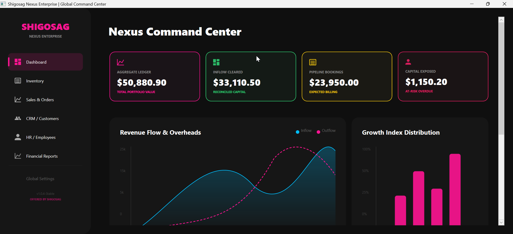
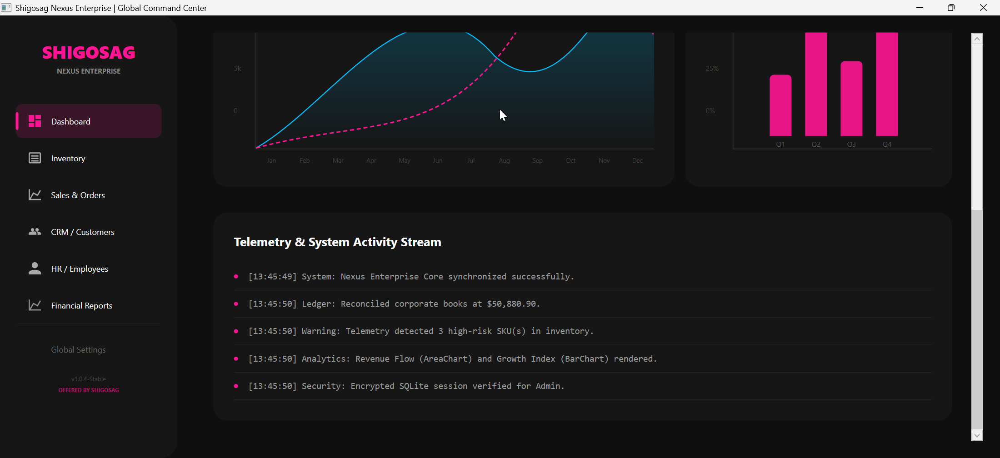
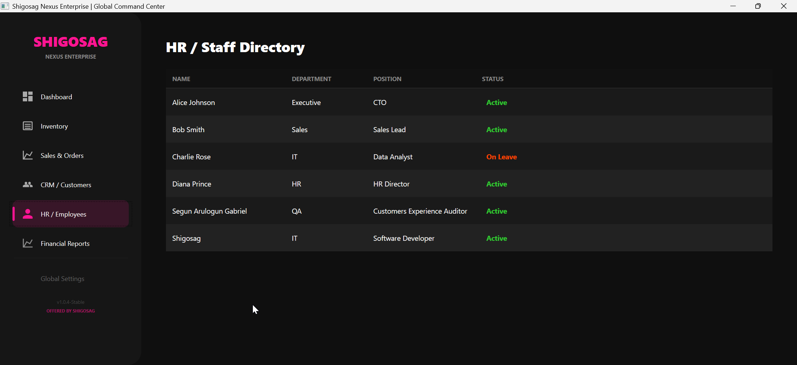
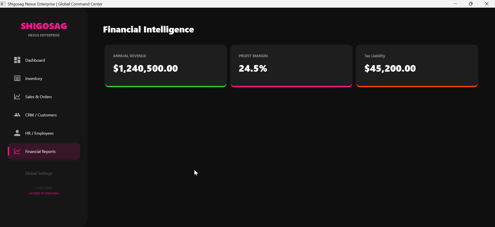
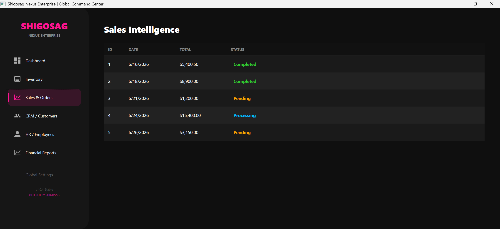
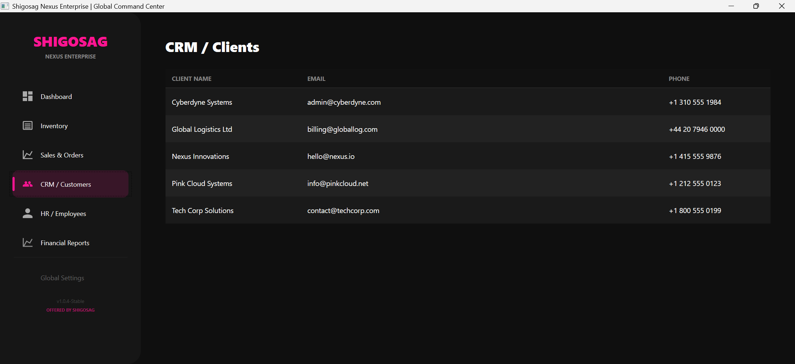

# 💖 Shigosag Nexus Enterprise ERP

[](https://dotnet.microsoft.com/)
[](https://www.microsoft.com/windows)
[](LICENSE)

**Shigosag Nexus Enterprise** is a high-density, production-ready C# WPF Desktop Application built for modern corporate management. Engineered on .NET 8, it features a sophisticated "Command Center" with custom Bezier-curved data visualization and high-performance telemetry.




### 🎥 System Walkthrough & Demo

<div align="center">
  <video src="https://github.com/user-attachments/assets/257bea57-9096-4529-a66f-2b27f856b13c" width="100%" controls></video>
</div>

**Timestamps:**
- **0:00** - Executable Launch & Authentication
- **0:17** - Nexus Command Center (Analytics)
- **0:42** - Sales & Inventory Modules
- **0:53** - HR & CRM Modules
- **1:03** - Finance & Settings
- **1:15** - GitHub Repository Overview

## 🚀 Key Features

### 📊 Intelligence & Visualization

*   **Revenue Flow AreaChart:** Smooth Bezier curves with soft gradients comparing Inflow (DeepSkyBlue) vs. Outflow (Rose Pink).
*   **Growth Index BarChart:** Precision quarterly velocity tracking with integrated Y-Axis measurement rulers.
*   **High-Impact KPI Cards:** Real-time telemetry for Aggregate Ledgers, Cleared Inflow, Pipeline Bookings, and Capital Exposure.

### 🛠️ Core Enterprise Modules

*   **Human Capital:** HR directory with semantic color-coded status tracking (Active/On Leave).
*   **Sales Intelligence:** Transaction ledger with professional data sorting and status management.
*   **CRM Intelligence:** High-density client relationship management database.
*   **Financial Intelligence:** Fiscal progress tracking with modernized KPI telemetry.

### 🎨 Modern UI/UX

*   **Sticky Sidebar:** Persistent navigation highlighting with a Rose Pink selection indicator.
*   **Vector Iconography:** High-performance SVG path-based library for infinite scaling.
*   **Modern DataTables:** Overhauled DataGrids with custom row heights and high-contrast visibility.

---

## 🗂️ Project Structure

```txt
ShigosagNexusERP/
├── ShigosagNexusERP.csproj
├── App.xaml
├── App.xaml.cs
├── Models/
│   ├── User.cs
│   ├── Product.cs
│   ├── Customer.cs
│   └── Order.cs
├── Data/
│   ├── AppDbContext.cs
│   └── DbInitializer.cs
├── Services/
│   ├── IAuthService.cs
│   ├── AuthService.cs
│   ├── IDataService.cs
│   └── DataService.cs
├── ViewModels/
│   ├── ViewModelBase.cs
│   ├── MainViewModel.cs
│   ├── DashboardViewModel.cs
│   └── InventoryViewModel.cs
├── Views/
│   ├── MainWindow.xaml
│   ├── MainWindow.xaml.cs
│   ├── DashboardView.xaml
│   ├── DashboardView.xaml.cs
│   └── InventoryView.xaml
├── Styles/
│   ├── Colors.xaml
│   ├── ButtonStyles.xaml
│   └── TextStyles.xaml
└── README.md
```

----

## 🖼️ Interface Preview

| HR & Staff Directory | Financial Intelligence |
| :---: | :---: |
|  |  |

| Sales & Orders Ledger | CRM Client Database |
| :---: | :---: |
|  |  |

---

## 💻 Tech Stack

*   **Framework:** .NET 8.0 (WPF)
*   **Architecture:** MVVM (Model-View-ViewModel)
*   **Toolkit:** CommunityToolkit.Mvvm
*   **Persistence:** Entity Framework Core with SQLite
*   **Security:** BCrypt.Net-Next Hashing
*   **Graphics:** Custom XAML Geometry & Path Data

---

## 🛠️ Installation & Setup

1.  **Prerequisites:**
    *   Install [.NET 8.0 SDK](https://dotnet.microsoft.com/en-us/download/dotnet/8.0).
    *   Install [Visual Studio 2022](https://visualstudio.microsoft.com/downloads/) (Workload: ".NET desktop development").

2.  **Clone the repository:**
    ```bash
    git clone https://github.com/Shigosag/ShigosagNexusERP.git
    cd ShigosagNexusERP
    ```

3.  **Build and Run:**
    ```bash
    dotnet restore
    dotnet build
    dotnet run
    ```

4.  **Default Credentials:**
    *   **Username:** `admin`
    *   **Password:** `admin123`

---

## 🛡️ Error Handling

The system includes a Nexus Bootloader with global exception handling. If the database file is locked or a XAML resource is missing, the application will provide a professional diagnostic message instead of crashing silently. 

---

## 👤 Author & Credits

- **Offered by Shigosag** 
- Portions of code generated with AI support
  
*Empowering enterprises through high-performance software architecture.*
---

## 📄 License

MIT License

© 2026 Shigosag

